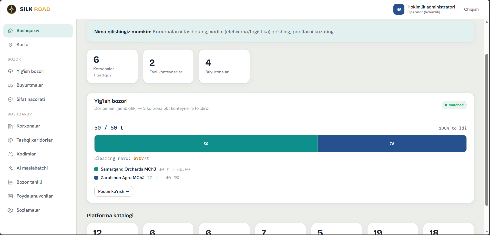
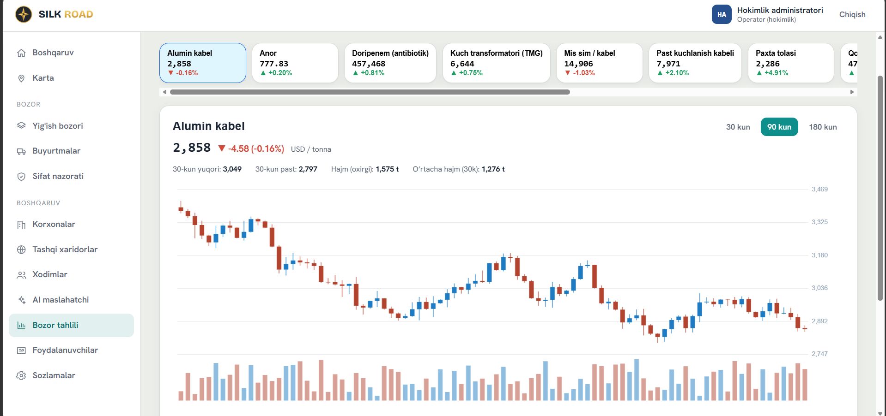
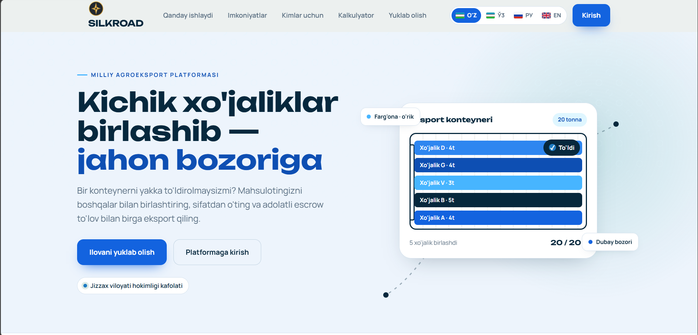
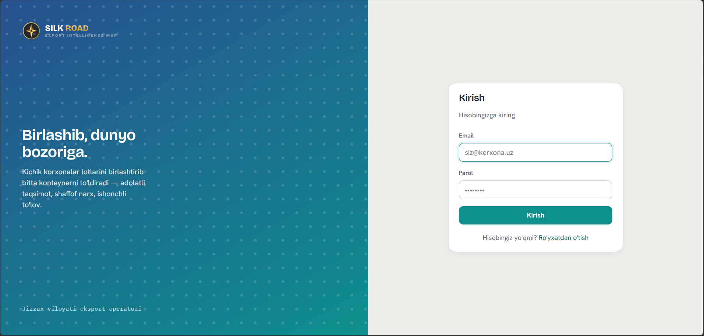

<div align="center">


# 🌾 Ipak Yo'li
## Milliy Agroeksport CRM Platformasi

**Jizzax viloyati hokimligi ishonchi ostidagi eksportni birlashtirish (Pooling) platformasi**

Kichik eksportyorlarni yagona tizimda birlashtirish, konteynerlarni to'ldirish,
eksport jarayonlarini avtomatlashtirish, escrow to'lovlari, logistika,
ombor, elchixona va AI yordamchisini bitta CRM ichida boshqarish.


</div>

---

# 🖼 Interfeys

## CRM Dashboard

<p align="center">

</p>

---

## Statistikalar

<p align="center">

</p>

---

## Landing Page

<p align="center">

</p>

---

## Login

<p align="center">

</p>

---

## Mobil Ilova

<p align="center">


</p>

---

# 🚀 Asosiy imkoniyatlar

✅ Eksport Pooling

✅ Container Sharing

✅ Escrow To'lov tizimi

✅ AI Maslahatchi

✅ Ombor boshqaruvi

✅ Logistika kompaniyalari

✅ Elchixona boshqaruvi

✅ Bozor tahlili

✅ Xarita (Sputnik Maps)

✅ Marshrut tavsiya qilish

✅ Candlestick narx grafiklari

✅ Reyting

✅ Sug'urta

✅ Hujjat aylanishi

✅ Nizolarni boshqarish

✅ Bildirishnomalar

---

# 🏗 Texnologiyalar

| Backend | Frontend | Database | Web |
|----------|-----------|----------|------|
| FastAPI | React | SQLite | Express |
| SQLAlchemy | Vite | Alembic | Node.js |
| JWT | React Router | SQLite | Express |

---

# 👥 Rollar

- 👑 Super Admin
- 🏢 Eksportyor
- 🌍 Importyor
- 🚚 Logistika
- 🏬 Ombor
- 🏛 Elchixona

---

# 📂 Loyiha tuzilishi

```
ipak-yoli/

backend/
    app/
    db/
    scripts/

frontend/
    src/

web/

assets/
    logo.png

    screenshots/
        dash-main.png
        dash-main-1.png
        dashmain-2.png
        dash-statits.png
        landing.png
        landing-1.png
        login.png
        mobil-login.png
        mobil-dash.png
        mobil-dash-1.png
        mobil-dash-2.png
        mobil-dash-3.png
        mobil-dash-4.png

start.sh
start.bat
seed_demo.sh
seed_demo.bat
README.md
```

---

# ⚙️ Talablar

- Python 3.10+
- Node.js 18+
- npm

---

# ▶️ Ishga tushirish

Linux/macOS

```bash
chmod +x start.sh
./start.sh
```

Windows

```cmd
start.bat
```

Skript avtomatik:

- Python virtual environment yaratadi
- dependencylarni o'rnatadi
- SQLite bazasini yaratadi
- demo ma'lumotlarni yuklaydi
- Backend
- Frontend
- Web saytni ishga tushiradi

---

# 🌐 Manzillar

| Xizmat | URL |
|---------|------|
| CRM | http://localhost:4444 |
| API | http://localhost:5555 |
| Swagger | http://localhost:5555/docs |
| Landing | http://localhost:3535 |

---

# 🔑 Super Admin

```
Email:
admin@ipakyoli.uz

Password:
admin12345
```

---

# 🌍 Domen

CRM

```
https://ipak.elektronbozor.uz
```

API

```
https://ipakapi.elektronbozor.uz
```

---

# 📍 Xarita

- Sputnik Maps
- GPS
- Omborlar
- Logistika
- Koridorlar
- Marshrut tavsiyasi
- Masofa hisoblash
- Haversine algoritmi

---

# 📈 Bozor tahlili

- Candlestick grafik
- 30 kun
- 90 kun
- 180 kun
- Narx tarixi
- UzEX
- Stat.uz
- data.egov.uz

---

# 🤖 AI Maslahatchi

Qo'llab-quvvatlanadigan AI:

- OpenAI
- Anthropic Claude
- Gemini

API kaliti admin paneldan kiritiladi.

---

# 📷 Barcha oynalar

| Desktop | Mobile |
|----------|---------|
| Dashboard | Dashboard |
| Statistikalar | Login |
| Landing | Pool |
| Login | AI |
| CRM | Xarita |

---

# ❤️ Muallif

**Ipak Yo'li Milliy Agroeksport CRM**

Jizzax viloyati hokimligi loyihasi

2025