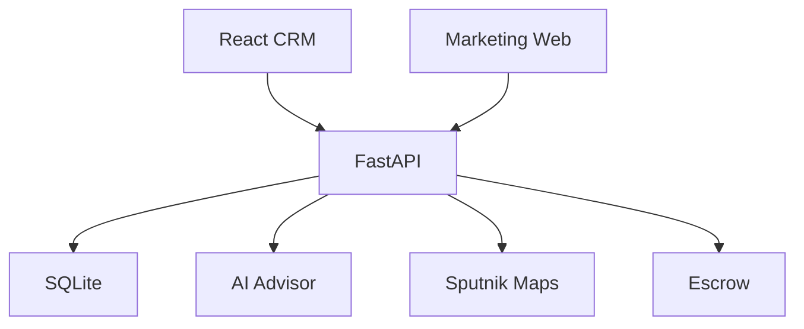

<p align="center">

</p>

<h1 align="center">
🚀 IPAK YO'LI
</h1>

<h3 align="center">
Milliy Agroeksport CRM Platformasi
</h3>

<p align="center">

Eksport • Import • Pooling • Logistika • AI • Xarita • Analitika

</p>

<p align="center">

<a href="https://ipak.elektronbozor.uz">

</a>

<a href="https://ipakapi.elektronbozor.uz/docs">

</a>

<a href="https://elektronbozor.uz">

</a>

<a href="https://github.com/USERNAME/ipak-yoli">

</a>

</p>

---

# 📖 Loyiha haqida

**IPAK YO'LI** — O'zbekiston eksportyorlari, importyorlari, logistika kompaniyalari va davlat tashkilotlari uchun ishlab chiqilgan zamonaviy Agroeksport CRM platformasi.

Platforma eksport jarayonlarini raqamlashtirish, kichik korxonalarni pooling texnologiyasi orqali birlashtirish, logistika zanjirini boshqarish va AI yordamida qaror qabul qilishni osonlashtirish uchun ishlab chiqilgan.

Tizim uchta asosiy qismdan iborat:

- ⚡ FastAPI Backend
- 💻 React CRM
- 🌐 Marketing Web

Barchasi bitta loyiha ichida ishlaydi va bitta buyruq bilan ishga tushiriladi.

---

# ✨ Asosiy imkoniyatlar

| Modul | Tavsifi |
|-------|---------|
| 🚚 Logistika | Yuklarni boshqarish |
| 📦 Pooling | Bir konteynerni birgalikda to'ldirish |
| 💰 Escrow | Xavfsiz to'lov tizimi |
| 👥 CRM | Eksportyor, Importyor, Ombor, Logistika, Elchixona va Admin |
| 📈 Bozor tahlili | Candlestick narx grafigi |
| 🗺️ Xarita | Sputnik xaritalari va marshrut |
| 📄 Elektron hujjatlar | Hujjatlar bilan ishlash |
| 🤖 AI Maslahatchi | OpenAI / Gemini / Claude |
| 🔐 Xavfsizlik | JWT Authentication |
| 📊 Dashboard | Real vaqt statistikasi |

---

# 🖥️ Platforma modullari

### 🚀 Backend

- FastAPI
- JWT Authentication
- REST API
- SQLite
- SQLAlchemy
- Alembic

---

### 💻 CRM

- React
- Vite
- Responsive UI
- Dashboard
- Charts

---

### 🌐 Marketing Web

- Express.js
- SEO
- Landing Page

---

# 🛠 Texnologiyalar

<p align="center">


</p>

---

# 🏗 Arxitektura



---

# 📸 Tizim ko'rinishlari

## Dashboard


---

## Xarita


---

## Bozor tahlili


---

## Pooling


---

# 🚀 Tez ishga tushirish

## Windows

```bash
start.bat
```

## Linux

```bash
chmod +x start.sh

./start.sh
```

---

# ⚙️ O'rnatish

```bash
git clone https://github.com/USERNAME/ipak-yoli.git
```

```bash
cd ipak-yoli
```

Windows

```bash
start.bat
```

Linux

```bash
./start.sh
```

Skript avtomatik ravishda:

- Virtual muhit yaratadi
- Kutubxonalarni o'rnatadi
- SQLite bazasini yaratadi
- Demo ma'lumotlarni yuklaydi
- Backend, CRM va Web qismlarini ishga tushiradi

---

# 🌍 Manzillar

| Xizmat | URL |
|---------|-----|
| CRM | https://ipak.elektronbozor.uz |
| API | https://ipakapi.elektronbozor.uz/docs |
| Marketing | https://elektronbozor.uz |

---

# 🤖 AI Maslahatchi

Platforma quyidagi AI provayderlarini qo'llab-quvvatlaydi.

- OpenAI
- Anthropic Claude
- Google Gemini
- Local LLM

API kaliti Admin panel orqali kiritiladi.

---

# 👥 Rollar

- 👑 Super Admin
- 🏢 Eksportyor
- 🌍 Importyor
- 🚚 Logistika
- 🏬 Ombor
- 🏛 Elchixona

---

# 📁 Loyiha tuzilishi

```text
ipak-yoli/

backend/

frontend/

web/

assets/

README.md
```

---

# 🛣 Roadmap

- ✅ CRM
- ✅ Pooling
- ✅ Escrow
- ✅ AI Advisor
- ✅ Market Analysis
- ✅ Maps
- 🚧 Android ilovasi
- 🚧 iOS ilovasi
- 🚧 Telegram Bot
- 🚧 AI Forecast
- 🚧 BI Dashboard

---

# 🤝 Hamkorlik

Loyihani rivojlantirish uchun Pull Request yuborishingiz mumkin.

1. Fork qiling.
2. Branch yarating.
3. Commit qiling.
4. Push qiling.
5. Pull Request yuboring.

---

# 📄 Litsenziya

MIT License

---

<div align="center">

## ⭐ IPAK YO'LI

Agar loyiha sizga foydali bo'lgan bo'lsa GitHub'da ⭐ Star bosishni unutmang.

Made with ❤️ in Uzbekistan

© 2025 Silk Road Export Intelligence Map

</div>
